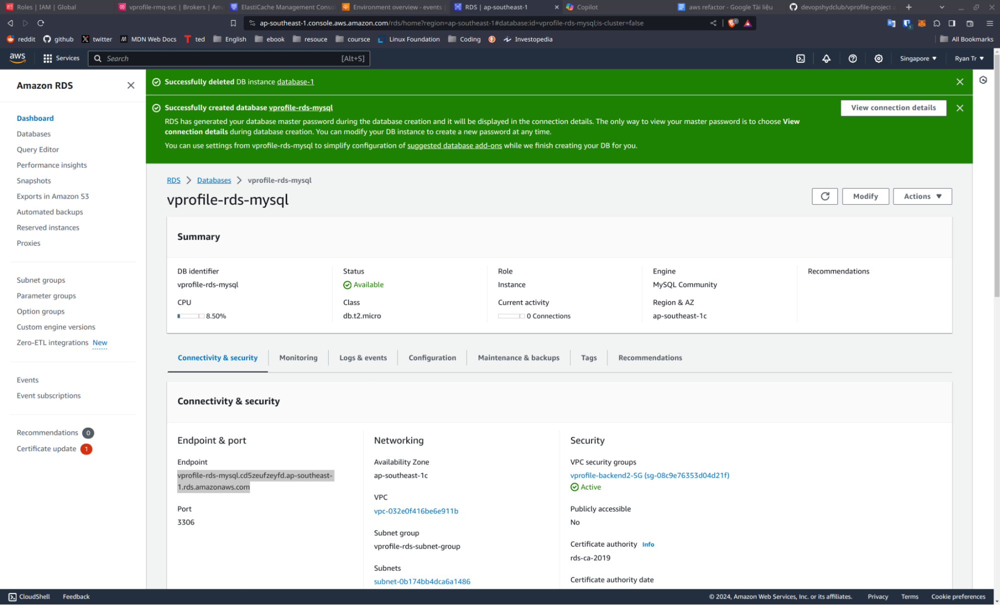
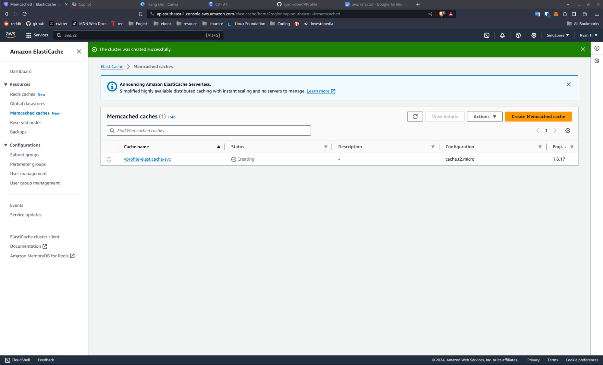
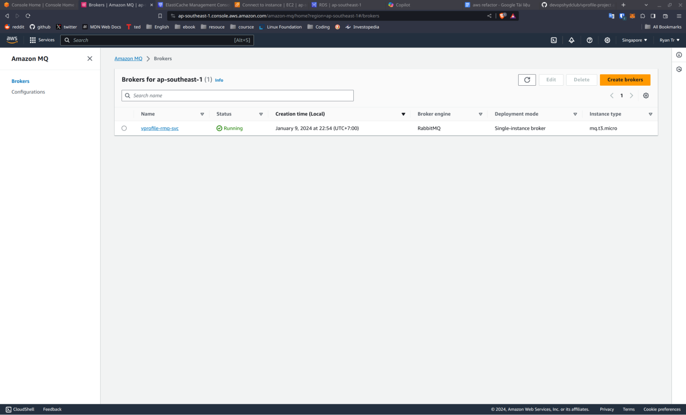
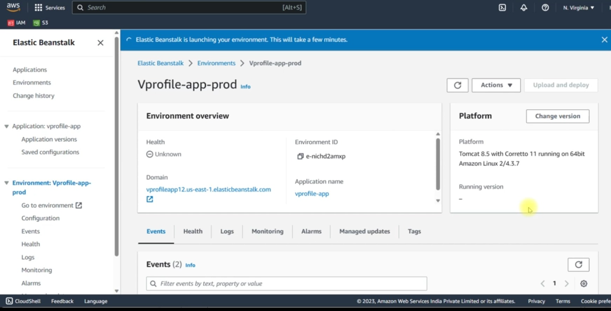
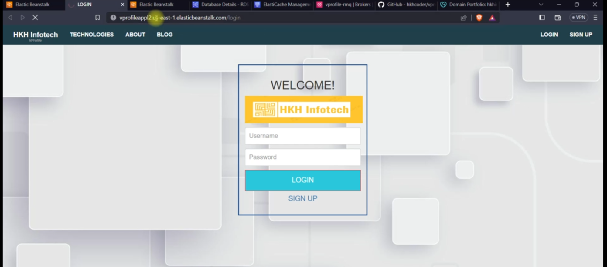

# Deploy  vprofile java project (MySQL, RabbitMQ, Memcached) using AWS service (RDS, AmazonMQ, ElasticCache, ElasticBeanstalk)

### Set up RDS MySQL

### Set up ElatiCache

### Set up AmazonMQ

### Set up BeanStalk

### Result
